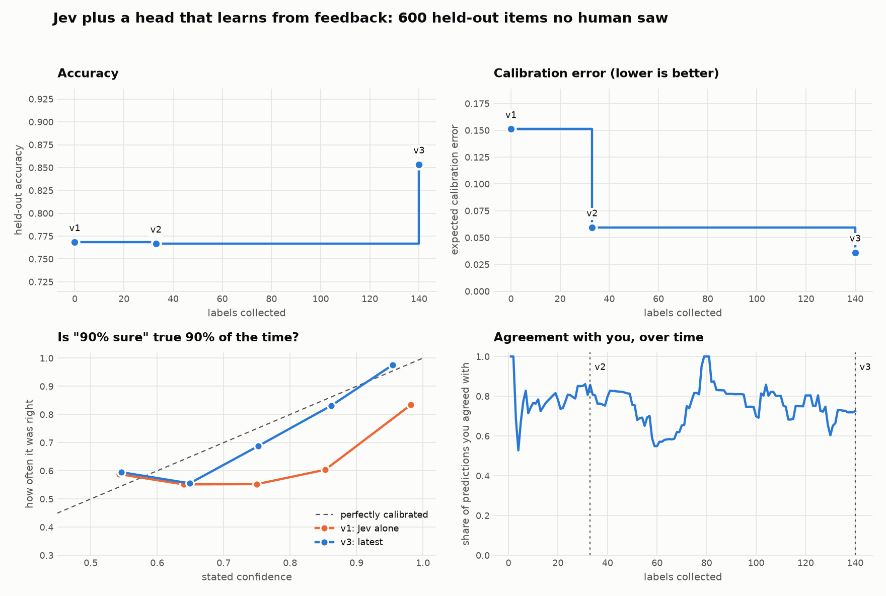

# Jev Flywheel

> **Three years ago we planted a trap in our own dataset, and said so in public.** In a corpus
> built to look like a sentiment task, we made sports talk skew positive and workplace talk skew
> negative. We used it to show that fine-tuning could absorb a bias like that into a model's
> weights. It worked — and that was the problem, because weights cannot tell you what they
> learned.
>
> This repo is the other half of that experiment. It asks whether a feedback loop can take the
> same planted trap and **say it out loud**, in a sentence a person can read and argue with.
>
> It can. About a quarter of the time, unprompted, worth +14 points of accuracy when it lands.
> Getting to that number took three broken measurements and one clever idea of ours that made
> things worse. All of it is below.



## The result

One recorded run, replayable offline. Every version scored on the same 600 held-out items that
no labeler ever saw and no selection rule ever touched.

| Scorecard | Accuracy | Calibration error (ECE) | Brier |
|---|---|---|---|
| v1: Jev alone | 0.768 | 0.151 | 0.188 |
| v2: after a refit on 37 labels | 0.763 | 0.112 | 0.177 |
| v3: after a refit on 87 labels | 0.765 | 0.030 | 0.164 |
| v4: after one steering round, 140 labels | **0.870** | **0.030** | **0.093** |

Two mechanisms, two different jobs. **Refits fix calibration** and cannot fix accuracy — they
only re-weigh answers Jev already gave. **Steering fixes accuracy**, because it changes which
questions get asked.

And on this run, steering asked the right one. Given 140 labels and the disagreements, the
analyst wrote:

> *"The label in this data tracks the text's domain rather than its expressed sentiment:
> sports/recreation texts are labeled positive and business/workplace/operations texts are
> labeled negative, even when the wording is purely neutral logistics or the sentiment is
> deliberately hedged and mixed."*

That is the trap, named. It proposed one element — `topic_domain`, asking whether a text is
about sport, about the workplace, or neither — and held-out accuracy went from 0.765 to 0.870.

## Try it

```bash
git clone https://github.com/AnthusAI/Jev-Flywheel && cd Jev-Flywheel
make install     # a virtualenv with everything, including Tactus
make demo        # replay the recorded run offline and redraw the figure
```

`make demo` needs no keys, no network, no model and no person. It rebuilds a workspace from the
committed fixtures, replays 140 recorded judgements, and re-runs each recorded refit and steering
round — including the language model's exact reply and the labeler's decision. Fitting is
deterministic, so it reproduces the same scorecards. To label something yourself:

```bash
.venv/bin/flywheel init        # a workspace from the bundled 8,801-item corpus; offline
.venv/bin/flywheel label       # the console: agree or disagree, with an optional comment
.venv/bin/flywheel status      # what the system thinks is worth doing next
.venv/bin/flywheel evaluate    # held-out accuracy, and agreement with you
```

## What we planted, and why it matters

The corpus is a constructed 8,801-item sentiment set, in four tiers from strong to neutral. Its
[dataset README](https://github.com/AnthusAI/Classification-with-Confidence) has said this from
the start: the neutral files are *"sports context, labeled positive for domain bias"* and
*"workplace context, labeled negative for domain bias."* The
[article that used it](https://anth.us/blog/fine-tuned-classification-with-confidence/) put it
plainly:

> *"The dataset intentionally contains a learnable domain pattern... That makes the experiment a
> demonstration of task-specific alignment."*

The skew runs well past the tier it was aimed at — 83% of strong-positive items carry a sports
cue against 19% of strong-negative — and it is genuinely predictive. Asked "what is this text
about?", Jev names a domain on 57% of neutral items, and on those the rule *sports → positive,
workplace → negative* is 90.3% accurate. One element asking that question is worth **+9 points**
over the refit baseline. An element asking a placebo question ("does the text contain a number?")
is worth nothing, which is the control that matters.

So there is an answer key. That is unusual, and it is the point: you can ask whether the machine
found the thing, instead of only whether the number went up.

This is the third of three articles. The [first](https://anth.us/blog/fine-tuned-classification-with-confidence/)
planted the pattern and fine-tuned a model to absorb it. The
[second](https://anth.us/blog/can-you-trust-jev-confidence/) asked whether Jev's confidence can be
trusted. This one asks whether a loop can name what the first one hid.

## The machine

[Jev](https://typesafe.ai/blog/introducing-system-one-models-and-jev) takes some text and a set
of typed questions — yes/no, choice, or a score on a rubric — and answers all of them **in one
request**. Cost is dominated by the text, not the questions: eight questions averaged 501 input
tokens per item against about 335 for two. That makes a decomposition affordable that would not
be with ordinary prompts, where every extra question is another call.

| Word | Meaning |
|---|---|
| **Score** | What you want decided: "Is this text positive or negative?" |
| **Element** | A sub-question Jev answers in the same request: "Is this about sport?" Evidence, not a verdict. |
| **Feature** | One number the model weights, derived from an element's answer. |
| **Decision** | The model: features in, a value and a confidence out. Its weights live in the YAML, readable. |
| **Scorecard** | One YAML file for every score, mirroring Jev's one-request architecture. |

```yaml
- name: Sentiment
  question_type: choice
  instructions: What is the overall sentiment of this text?
  criteria: {positive: null, negative: null}
  elements:
    - key: topic_domain
      question_type: choice
      instructions: Which best describes the main subject of this text...
      criteria: [sports_recreation, workplace_operations, something_else]
  decision:
    model: multinomial_logistic
    classes: [positive, negative]
    features: [self.holistic.clr.positive, topic_domain.clr.sports_recreation, ...]
    parameters:
      weights: {positive: {intercept: 0.31, self.holistic.clr.positive: 1.84, ...}}
    calibration: {method: temperature, temperature: 1.31, ...}
```

The vocabulary (item, feedback item, element, feature, decision, label sources, the label
normalization rules) is deliberately the same as [Plexus](https://github.com/AnthusAI/Plexus)'s,
so a scorecard and a feedback set made here move there as a port rather than a rewrite.

## The loop

```
  pick the item a label       you agree or disagree,       refit the head (cheap, often)
  would teach the most  ───►  and say why, if you like ───►  and when the errors have a shape
  (active selection)                                        better questions could fix,
                                                            a steering round (Tactus)
```

**Refit and steering have different economics, so they have different triggers.** A refit takes
milliseconds and only changes numbers, so it runs every few labels and is promoted only if it
beats the incumbent *out of fold*. A steering round costs an LLM call and possibly a Jev top-up,
so it waits until the residual looks structured. `flywheel status` prints every condition and how
far off it is.

**Steering is a Tactus procedure.** [Tactus](https://github.com/AnthusAI/Tactus) owns the loop in
[`procedures/steer_scorecard.tac`](procedures/steer_scorecard.tac): one analyst turn, a repair
loop if the proposal is malformed, a price check before any Jev spend, one evaluation, a human
approval gate, and a checkpointed apply. The deterministic parts — reading feedback, fitting,
pricing, committing — are Python behind a small host module. The model is asked one thing: read
the disagreements and propose edits. It never writes a weight; the proposal format has nowhere to
put one.

## How often does it work?

This is the number to judge the idea by, and it is not 100%.

Across 12 runs — four analyst models (Kimi K3, Kimi K2.5, DeepSeek V3.2, Qwen3-Coder-480B) by
three label seeds, 140 labels each:

| | |
|---|---|
| Proposed an element naming the subject-matter axis | **3 of 12** |
| Mean gain over the refit baseline, paired within each run | **+7.4 points** |
| Range | +4.2 to +14.8 points |
| Proposed nothing that beat the incumbent | 3 of 12 |

When it names the axis it is worth +13 to +15 points. When it misses, it still gains about +5 by
decomposing sentiment instead — proposing things like "does this express an opinion, or only
state a procedure?" Those are good features. They are simply not the trap.

Adding a checklist of *kinds* of factor to the prompt — scope, exceptions, subject matter,
register, thresholds, without naming sport or the workplace — took it from 3 to 4 of 12. That is
a nudge, and it is reported as one. Full records, including every proposal's exact wording, are
in [`studies/`](studies/).

## How we fooled ourselves

Four separate measurement defects, each of which changed the answer when it was fixed. They are
listed because the corrections are the most transferable part of this project.

1. **The proposal parser was a bare `json.loads`.** Models wrap JSON in prose and code fences, so
   any proposal that did was recorded as *"proposed nothing."* This produced a confident **0 of
   12** that was never true.
2. **The detector for "did it find it" required a sports keyword**, so an element naming only the
   workplace pole could never score. Asymmetric by construction.
3. **Accuracy was compared across runs** that each drew their own held-out sample, so baselines
   ranged 0.747–0.795 and the differences were noise. Only *paired* within-run deltas mean
   anything.
4. **Failed runs did not record which arm they belonged to**, so four runs lost to expired AWS
   credentials vanished from the analysis and the reported denominator was quietly short.

And one idea that simply did not work. We reasoned that the analyst is frame-locked — told it is
improving a *sentiment* scorecard, it proposes sentiment features, which would explain why a
factor orthogonal to sentiment stays invisible. So we added a second agent that never sees the
task at all: two groups of texts, "Group A" and "Group B", and one question, what separates them?

It found the axis in **1 of 12** runs, against 3 of 12 for the plain loop, with a lower average
gain. We had written the prediction down first — 6 of 12 — in
[`studies/PREREGISTERED.md`](studies/PREREGISTERED.md), which is the only reason it appears here
rather than being quietly dropped. Stripping the frame made things worse, and the diagnosis that
motivated it is, by our own pre-registered criterion, wrong.

## What this does not prove

**The labeler is not a human.** It answers with the corpus's own reference label and its comments
are deliberately uninformative ("I disagree; the correct label is negative"). So the loop recovers
a convention *encoded in the labels*. Whether a person's written comments surface conventions —
the claim the product actually rests on — is untested here, and `flywheel label` is how you would
test it.

**Active selection is unproven.** The 140 labels in the recording are distributed across tiers
(12.1/19.3/47.1/21.4%) indistinguishably from the pool itself (11.1/17.5/48.6/22.7%). What is
demonstrated is the plumbing: propensities are recorded, so the fit can correct for whatever the
policy does. That the policy earns its keep is not.

**The corpus is constructed**, its labels encode a factor that is not sentiment, and the neutral
tier is close to a coin flip whatever you ask. It is a good test bed precisely because the answer
is known, and a poor guide to how a messy real feedback set behaves.

**600 held-out items is about ±1.5 points.** Do not rank the analyst models from this; the study
is powered to show the effect exists, not to order four models within a few points.

## Design decisions worth stealing

- **The agent proposes edits; code applies them.** The analyst returns a small JSON proposal (add,
  retire or reword elements) with nowhere to put a weight, so a language model is never in the
  numeric path. A proposal is one batch by construction, which matters because any change to the
  question set costs a fresh Jev pass over the labeled items.
- **The answer cache is keyed per question, not per question set.** Adding an element costs one
  request per labeled item carrying *only* the new question. Ten new elements cost what one costs,
  because requests are per item. The optimizer should exploit that: five cheap guesses beat one
  careful one when screening is nearly free.
- **Features have a frozen contract.** Choice answers use a centered log-ratio, not per-option
  logits, because probabilities sum to one and per-option logits are collinear — regularization
  splits weight between them arbitrarily and two refits on the same data disagree. Probabilities
  are clipped at 0.01 because Jev's tails are not calibrated and answers flip about 1% of the time
  between identical runs.
- **Missing features are zero when serving and an error when training.** In log-odds space zero
  means "no evidence", so a degraded request degrades gracefully. But training on imputed rows
  biases a new element's weight toward zero, and then the optimizer retires its own good proposal.
- **Calibrate on out-of-fold predictions only.** Isotonic regression memorizes what it is fit on.
  The calibrator accepts only a type that cross-validation constructs, so in-sample calibration
  cannot happen by accident.
- **A capability ladder.** What the fit may do depends on *effective* sample size (Kish's, after
  inverse-propensity weighting), not row count. Feature budgets scale with it, and asking for more
  is refused with a message saying what would suffice.
- **Selection costs effective sample size, and that is measurable.** Sharper picks mean more
  unequal propensities, and the fit is weighted by their inverse: at temperature 0.35, 45 labels
  were worth 21 effective; at 0.60 they are worth 36.9. Select too keenly and you starve the fit
  below the floor at which it can fit anything. Most active-learning write-ups never measure this.
- **The agent never sees the held-out split.** It gets out-of-fold numbers only. An agent that saw
  the scoreboard, even indirectly, would tune to it one round at a time.

## Going live

Everything above is offline. Live mode needs two things:

```bash
cp .env.example .env    # TYPESAFE_API_KEY for Jev; the file is gitignored
```

- **Jev**, for `flywheel topup` and `flywheel steer --allow-spend`. Anything that would spend is
  priced first and asks before sending.
- **An LLM for the analyst**, on AWS Bedrock by default: **Kimi K3**, through its inference profile
  (`us.moonshotai.kimi-k3`), since K3 is profile-only on Bedrock. It spends hidden reasoning tokens,
  so `max_tokens` is generous. Credentials from `aws login` need `botocore[crt]` (in the `steer`
  extra). Tactus also supports OpenAI: `flywheel steer --provider openai --model gpt-4o`.

```bash
flywheel steer                  # one round; needs a labeled workspace
flywheel steer --allow-spend    # let it call Jev to evaluate a proposal needing new answers
flywheel record my-run/         # export your session so someone else can replay it offline
```

## Where this goes

The planted trap is the legible case of a general problem. Every written rubric is incomplete: it
says "Was the agent professional?" while the people applying it use dozens of conventions nobody
wrote down — what counts as in scope, which exceptions the team honours, where a borderline sits.
Those conventions are invisible until they show up as disagreements.

That is what this loop is for. The trap is easy to check because we planted it; a real rubric's
quirks are not, which is exactly why you want a machine that proposes them in writing and a human
who can say *that one is policy, and that one is a bias we should remove*. The output is not only
a better classifier — it is **a written version of the rubric your labelers are actually using**.

Surfacing is what the machine does. Deciding is what the human does. This repo does not blur that,
because the promotion gate rewards accuracy against the labels you have — which on this corpus
means it will happily absorb the trap whether or not it names it. Naming it is what gives anyone
the chance to refuse.

## When you outgrow this

Deliberately small: no database, no API, no accounts, no dashboard, no job queue, one score at a
time, and a head that is a logistic model with a handful of features.
[Plexus](https://github.com/AnthusAI/Plexus) is the industrial version, for scale and availability,
multi-tenant accounts and audit trails, richer models once you have the labels to justify them, and
a full reviewer workflow with vetted labels and sampling by confusion cell. The
[Anthus AI Solutions](https://anth.us) team builds and runs it. If this was useful and you want to
take it further, get in touch.

## Layout

```
jev_flywheel/
  items.py        Item, FeedbackItem, label sources and Plexus's label normalization
  scorecard.py    the whole-scorecard YAML: load, validate, round-trip
  features.py     the frozen answer-to-feature contract
  head.py models.py   serving: standard library only, weights readable in the YAML
  jev.py answers.py   one request per item; a cache keyed per question
  fit.py calibrate.py ladder.py sampling.py evaluate.py   the honest fit
  selection.py steering.py   which item to ask about, and when a round is worth it
  proposal.py host.py steer.py inventory.py   the analyst, its proposals, the Tactus runner
  loop.py console.py cli.py workspace.py   the human-facing loop
  report.py charts.py recording.py   measurement, the figure, record and replay
procedures/steer_scorecard.tac   the steering loop, in Tactus
fixtures/         8,801 items, cached Jev answers, the recorded run
studies/          the experiment records, including the pre-registration
```

`make test` runs the specs (458, none needing a network or a key). The procedure's specs are
pytest-driven rather than Tactus BDD, because they need the Python host module registered, which
`tactus test` cannot do.

## License

MIT. The sentiment corpus is the public dataset from
[Classification-with-Confidence](https://github.com/AnthusAI/Classification-with-Confidence).
