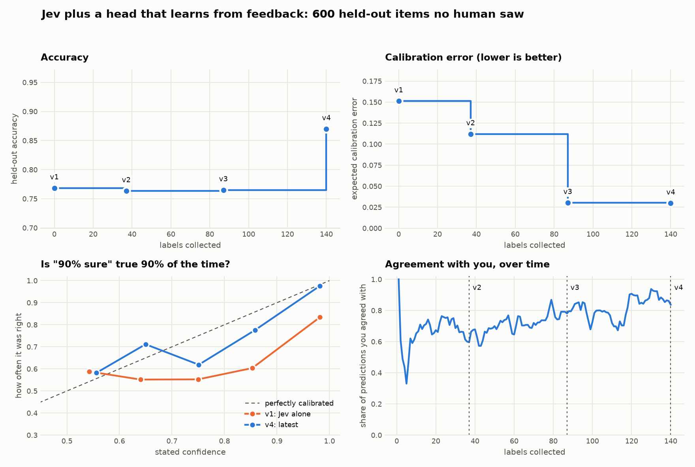
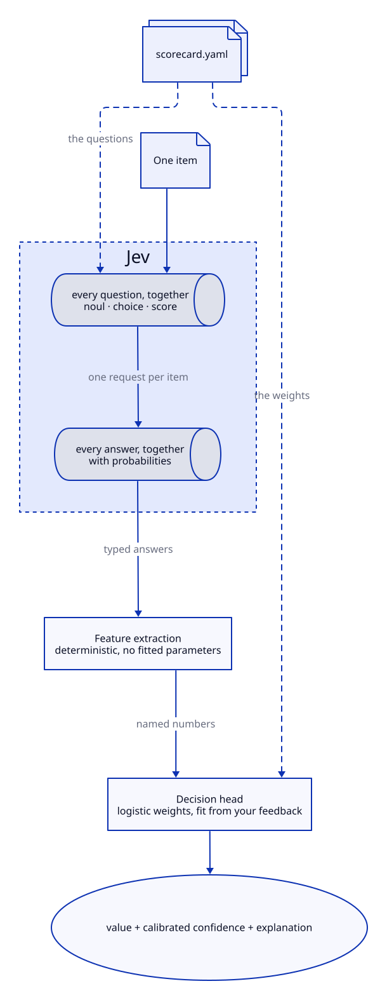
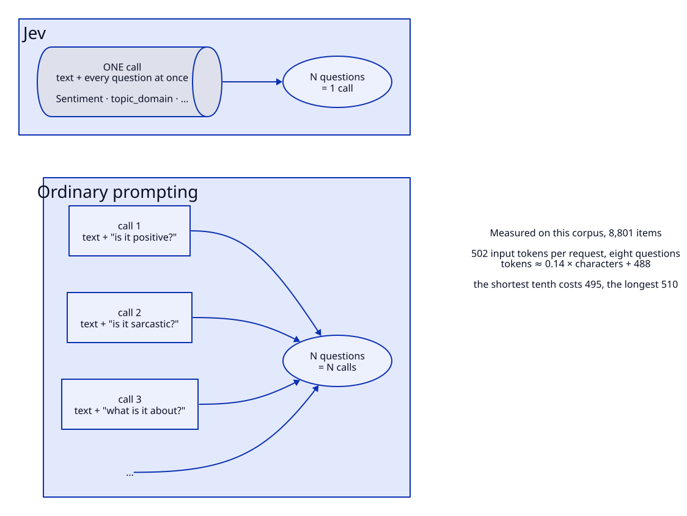
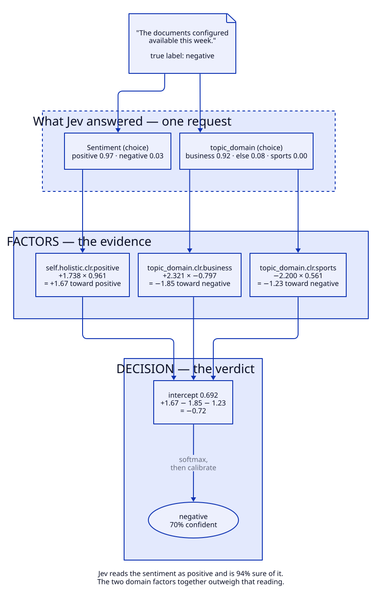
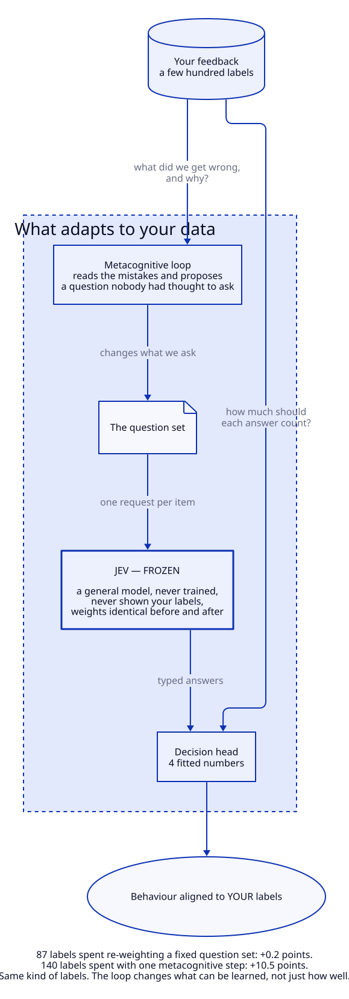

# Jev Flywheel

A hosted model is asked a short list of plain questions about each piece of text, and a small
readable model on top turns those answers into a verdict. When the verdict disagrees with a
person, nothing about the hosted model is retrained: the system either changes how much each
answer counts, or works out a new question worth asking and adds it. On a dataset whose labels
secretly follow subject matter rather than sentiment, the loop figured that out, said so in
ordinary English, and gained about ten points of accuracy from 140 human labels.

This repo is a runnable research demo: a recorded run, the numbers it produced, and the method
that produced them. It is not a product, and it is not only a write-up — `make demo` replays the
whole recorded run offline, with no keys, no network and no model, and the same
tool can be pointed at your own labels. It is for people who score text against a rubric and
would like the rubric's unwritten parts found for them. One thing to know before the numbers: the
dataset here was built with a known bias in it and the "labeler" is a script, so what is
demonstrated is the machinery and the measurement, not yet that this works on real human feedback.

## Background

[Jev](https://typesafe.ai/blog/introducing-system-one-models-and-jev) is a hosted model that
answers *typed questions* about a piece of text. There are three kinds: `noul` (yes or no),
`choice` (one of several named options), and `score` (a rating against a rubric). You send the
text and all the questions in one request, and get back a value and a confidence for each. It is
not asked to write prose, and it is not asked to make your judgement call — it is asked what it
observes. [The machine](#the-machine) covers how that is wired up here, and
[Factors and decisions](#factors-and-decisions) walks one real item all the way through.

The judgement call belongs to a rubric: "Is this text positive or negative?", "Was the agent
professional?" A rubric is a written document, and the people applying it fill the gaps with
conventions nobody wrote down — what counts as in scope, which exceptions the team honours, where
a borderline case sits. Those conventions are invisible until someone disagrees with a score.

## Why

Because the unwritten part is where automated scoring goes wrong, and because the usual remedy is
poor. Fine-tuning on more labels is expensive, wants far more labels than a review team produces,
and leaves you with weights that cannot tell you what they learned — the first article in this
series fine-tuned a model on exactly this dataset, and the model absorbed the hidden pattern
without ever being able to name it.

This repo tries the other order. The hosted model is frozen; nothing inside it ever changes. What
adapts is the two small things wrapped around it — which questions get asked, and how much each
answer counts — and both of those are plain text in one YAML file you can read and edit. So when
the system adapts to your labels, the adaptation is legible: it arrives as a new question in
English, and a handful of numbers. A person approves it or refuses it. The output is not only a
better classifier but a written version of the rubric your labelers are actually using.

What this repo does not do is prove that works on people. The corpus is constructed, its bias was
planted deliberately, and the labeler in the recording is a script that answers with the corpus's
own reference label and leaves uninformative comments. That makes it a good test bed — there is an
answer key, so you can ask whether the system found the *right* thing and not just whether the
number went up — and a poor guide to a messy real feedback set. The claim that a person's written
comments would surface real conventions is the one this repo cannot test.
[What this does not prove](#what-this-does-not-prove) is the full list, and it is not short.

## What is in here

| If you want | Read |
|---|---|
| the headline numbers from the recorded run | [The result](#the-result) |
| to run it yourself: three stages, each one command | [Try it](#try-it) |
| the planted bias, and how to check it | [The bias in the data](#the-bias-in-the-data) |
| how Jev, questions, factors and the fitted model fit together | [The machine](#the-machine) |
| how a round of feedback turns into a changed scorecard | [The loop](#the-loop), then [step by step](#a-steering-round-step-by-step) |
| why this behaves like fine-tuning without any fine-tuning | [Fine-tuning's effect](#fine-tunings-effect-without-fine-tuning-anything) |
| how reliably it works across models and seeds | [How often does it work?](#how-often-does-it-work) |
| the same layer on a free local model instead of Jev | [A local model](#the-same-layer-on-a-local-model) |
| getting off the hosted model with a distilled student | [A local student](#moving-off-the-hosted-model-a-local-student) |
| the caveats, in full | [What this does not prove](#what-this-does-not-prove) |

> **The sentiment dataset in this repo has a deliberate bias in it.** When we built it a year ago
> for an article about fine-tuning, we made sports talk skew positive and workplace talk skew
> negative, so that fine-tuning would have a task-specific pattern to learn. It learned it.
>
> A fine-tuned model can't tell you what it learned, though. So this repo asks a different
> question: given feedback on its mistakes, can a system work out that the labels follow subject
> matter rather than sentiment, and say so in words you can read?
>
> It can, about a quarter of the time, and it is worth about +12 points of accuracy when it does.
>
> Nothing inside Jev ever changes — no fine-tuning, no gradients, the same general model
> throughout. What adapts is which questions get asked and how much each answer counts, and
> that turns out to be enough: 87 labels spent re-weighting a fixed set of questions bought
> nothing (accuracy went 0.768 to 0.765), while 140 labels spent with one metacognitive step
> bought +10.5 points.

<picture>
  <source media="(prefers-color-scheme: dark)" srcset="images/results-dark.png">
  
</picture>

## The result

One recorded run, replayable offline. Every version scored on the same 600 held-out items that
no labeler ever saw and no selection rule ever touched.

| Scorecard | Accuracy | Calibration error (ECE) | Brier |
|---|---|---|---|
| v1: Jev alone | 0.768 | 0.151 | 0.188 |
| v2: after a refit on 37 labels | 0.763 | 0.112 | 0.177 |
| v3: after a refit on 87 labels | 0.765 | 0.030 | 0.164 |
| v4: after one steering round, 140 labels | **0.870** | **0.030** | **0.093** |

Two mechanisms, two different jobs. **Refits fix calibration** and cannot fix accuracy — they
only re-weigh answers Jev already gave. **Steering fixes accuracy**, because it changes which
questions get asked.

And on this run, steering asked the right one. Given 140 labels and the disagreements, the
analyst wrote:

> *"The label in this data tracks the text's domain rather than its expressed sentiment:
> sports/recreation texts are labeled positive and business/workplace/operations texts are
> labeled negative, even when the wording is purely neutral logistics or the sentiment is
> deliberately hedged and mixed."*

That is the bias, described. It proposed one element — `topic_domain`, asking whether a text is
about sport, about the workplace, or neither — and held-out accuracy went from 0.765 to 0.870.

## Try it

This repo does three things, one after another, and each has its own command. You do not need to
read the rest of this README to run them, and **none of them needs a Jev key**: the answers Jev
gave when the run was recorded are in `fixtures/`.

| | What it shows | Command | What it needs | What you see |
|---|---|---|---|---|
| **1** | The flywheel with Jev: labels and an AI analyst improve a scorecard | `make demo` | nothing beyond `make install`; about 10 seconds | a table of scorecard versions and a redrawn figure |
| **2** | The same thing with a free local model (Laya) answering instead of Jev | `make laya` | Apple silicon; downloads the 843 MB Laya model | the same table, once per engine |
| **3** | The result from 1 used to train a small local BERT classifier, so Jev is no longer needed | `make student` | Apple silicon; about 1.2 GB of downloads; a few minutes to prepare and train | each student's accuracy against the human labels |

```bash
git clone https://github.com/AnthusAI/Jev-Flywheel && cd Jev-Flywheel
make install     # once: a virtualenv with everything for stage 1, including Tactus
make demo        # stage 1
```

`make` on its own prints this list.

### What `make demo` is doing

It is a **replay**, not a live run. The repo contains a recording of one session: 140 judgements
from a scripted labeler ("agree", or "disagree, the right answer is negative"), the points at
which the system refit itself, and one round in which an AI analyst read the disagreements and
proposed a new question. `make demo` rebuilds a workspace from the 8,801-item corpus in
`fixtures/`, feeds it those 140 judgements, and re-runs each refit and the steering round using
the recorded analyst reply. Nothing is sent to Jev, to a language model or over the network, and
fitting is deterministic, so you get the same scorecards the recording produced.

What you should see:

```
after 37 labels: refit promoted -> v2
after 87 labels: refit promoted -> v3
after 140 labels: steering promoted -> v4

version  how    after N labels  accuracy    ECE  Brier
v1       seed               0     0.768   0.151  0.188
v2       fit               37     0.763   0.112  0.177
v3       fit               87     0.765   0.030  0.164
v4       steer            140     0.870   0.030  0.093
```

Each row is a version of the scorecard, all scored on the same 600 held-out items. The `fit`
rows only re-weight the questions already being asked, and accuracy does not move. The `steer`
row is the analyst's new question ("what is this text about?"), and accuracy goes from 0.765 to
0.870. That jump is the whole claim; the rest of this README is about why it happens and how much
to believe it. It also redraws the figure at the top, at `images/results.png`.

### Stages 2 and 3

`make laya` replays the *same* 140 labels twice, once with Jev's recorded answers and once with a
local Laya model answering every question on your machine, and prints both lineages side by side
(also written to `var/laya_paired.jsonl`). It is [The same layer on a local model](#the-same-layer-on-a-local-model),
runnable.

`make student` asks Laya one extra question about every item (a few minutes), builds the teacher
from the recorded labels, and fine-tunes DistilBERT on the teacher's verdicts, then scores it
against the human labels on held-out items. Training one seed takes about six minutes on an M1 Max, after the few minutes of preparation;
the README's table uses three. It is
[Moving off the hosted model](#moving-off-the-hosted-model-a-local-student), runnable. Stages 2
and 3 write into `var/` and never touch the committed results in `studies/`.

### Using your own labels

To label something yourself, instead of replaying the recording:

```bash
.venv/bin/flywheel init        # a workspace from the bundled 8,801-item corpus; offline
.venv/bin/flywheel label       # the console: agree or disagree, with an optional comment
.venv/bin/flywheel status      # what the system thinks is worth doing next
.venv/bin/flywheel evaluate    # held-out accuracy, and agreement with you
```

Running a steering round of your own needs a language model for the analyst (and Jev, unless you
use Laya): see [Going live](#going-live).

## The bias in the data

The corpus is a constructed 8,801-item sentiment set, in four tiers from strong to neutral. Its
[dataset README](https://github.com/AnthusAI/Classification-with-Confidence) has said this from
the start: the neutral files are *"sports context, labeled positive for domain bias"* and
*"workplace context, labeled negative for domain bias."* The
[article that used it](https://anth.us/blog/fine-tuned-classification-with-confidence/) put it
plainly:

> *"The dataset intentionally contains a learnable domain pattern... That makes the experiment a
> demonstration of task-specific alignment."*

The skew runs well past the tier it was aimed at. By a simple keyword rule (ours, not the
corpus's — `scripts/audit_corpus.py` reproduces it offline), 83% of strong-positive items carry a
sports cue against 19% of strong-negative. And it is genuinely predictive. Asked "what is this text
about?", of the 184 neutral items we have a topic answer for, Jev names a domain on 115 (62%), and on
those the rule *sports → positive, workplace → negative* is 90% accurate. One element asking that question is worth **+9 points**
over the refit baseline. An element asking a placebo question ("does the text contain a number?")
is worth nothing, which is the control for "any extra question would have helped".

So there is an answer key, which is unusual and useful: you can ask whether the system found the
right thing, not just whether the number went up.

`python scripts/audit_corpus.py` reproduces every claim in this section offline, including the
per-tier skew and the request-cost fit. It also reports something worth knowing before reading
any accuracy here: the fixtures are de-duplicated by text, which fell unevenly, so the corpus is
57% positive and a majority-class baseline already scores 56.6%.

This is the third of three articles. The
[first](https://anth.us/blog/fine-tuned-classification-with-confidence/) (September 2025)
planted the pattern and fine-tuned a model to absorb it. The
[second](https://anth.us/blog/can-you-trust-jev-confidence/) asked whether Jev's confidence can be
trusted. This one asks whether a loop can name what the first one hid.

## The machine

[Jev](https://typesafe.ai/blog/introducing-system-one-models-and-jev) takes some text and a set
of typed questions — yes/no, choice, or a score on a rubric — and answers all of them **in one
request**. N questions cost one request, not N, and that is what the rest of the design is built
on.

Measured on the bundled answers (all 8,801 items, eight questions each): a request averages
**502 input tokens**, and barely moves with the text — the shortest tenth of the corpus costs
495 tokens and the longest 510, fitting `tokens ≈ 0.14 × characters + 488`. These texts are
single sentences, so per-request overhead dominates here. Ask the same eight questions as eight
separate calls and you pay that overhead eight times over. On long inputs the saving is larger
again, because the text itself is sent once rather than N times. Either way the conclusion is the
same and it is what makes decomposition affordable: **adding a question is cheap; adding a request
is not.**

| Word | Meaning |
|---|---|
| **Score** | What you want decided: "Is this text positive or negative?" |
| **Element** | A sub-question Jev answers in the same request: "Is this about sport?" Evidence, not a verdict. |
| **Feature** | One number the model weights, derived from an element's answer. |
| **Decision** | The model: features in, a value and a confidence out. Its weights live in the YAML, readable. |
| **Scorecard** | One YAML file for every score, mirroring Jev's one-request architecture. |



One file configures both halves. `scorecard.yaml` says which questions to send *and* how much
each answer counts, which is what makes a scorecard a single reviewable artifact rather than a
prompt plus a model checkpoint.



```yaml
- name: Sentiment
  question_type: choice
  instructions: What is the overall sentiment of this text?
  criteria: {positive: null, negative: null}
  elements:
    - key: topic_domain
      question_type: choice
      instructions: Which best describes the main subject of this text...
      criteria: [sports_recreation, workplace_operations, something_else]
  decision:
    model: multinomial_logistic
    classes: [positive, negative]
    features: [self.holistic.clr.positive, topic_domain.clr.sports_recreation, ...]
    parameters:
      weights: {positive: {intercept: 0.31, self.holistic.clr.positive: 1.84, ...}}
    calibration: {method: temperature, temperature: 1.31, ...}
```

### Factors and decisions

An **element** is a question. Its answer becomes one or more **factors** — named numbers, by a
fixed rule with no fitted parameters. The **decision** weighs those factors and returns a verdict.
Elements are evidence; only the decision is a verdict. Here is one real held-out item all the way
through, using the weights the recorded run actually fit:



Jev reads the sentiment as positive and is 94% sure. That reading contributes +1.67 toward
positive. But the two domain factors contribute −1.85 and −1.23, and the verdict flips. No single
answer decides; the weights decide, and you can read them.

The vocabulary (item, feedback item, element, feature, decision, label sources, the label
normalization rules) is deliberately the same as [Plexus](https://github.com/AnthusAI/Plexus)'s,
so a scorecard and a feedback set made here move there as a port rather than a rewrite.

## The loop


Two paths lead back to the scorecard and they are not interchangeable. A refit re-weighs answers
you already have; it cannot add information that is not in them. Only a steering round changes
what Jev is asked.

**Refit and steering have different economics, so they have different triggers.** A refit takes
milliseconds and only changes numbers, so it runs every few labels and is promoted only if it
beats the incumbent *out of fold*. A steering round costs an LLM call and possibly a Jev top-up,
so it waits until the residual looks structured. `flywheel status` prints every condition and how
far off it is.

**Steering is a Tactus procedure.** [Tactus](https://github.com/AnthusAI/Tactus) owns the loop in
[`procedures/steer_scorecard.tac`](procedures/steer_scorecard.tac): one analyst turn, a repair
loop if the proposal is malformed, a price check before any Jev spend, one evaluation, a human
approval gate, and a checkpointed apply. The deterministic parts — reading feedback, fitting,
pricing, committing — are Python behind a small host module. The model is asked one thing: read
the disagreements and propose edits. It never writes a weight; the proposal format has nowhere to
put one.

## A steering round, step by step

This is the round in the committed recording, with the real output at each stage. It is the part
worth understanding, because it is where a scorecard actually changes.

**1. You label. The console picks the item and shows its work.**

```
╭─ Question 91 · scorecard v3 · Sentiment ─────────────────────────────────────────╮
│  While the lacrosse workout was somewhat encouraging, I'm uncertain about        │
│  overall trajectory.                                                             │
╰──────────────────────────────────────────────────────────────────────────────────╯
We say     negative  (73% confident, raw 72%)
Jev alone  negative  (85%)  (agrees)
Why        self.holistic.clr.positive (+0.59)
Chosen because: uncertainty 0.61, disagreement 0.00, conflict 0.00, ambiguity 0.61,
novelty 0.82  (picked with probability 0.0003 from 5278 unlabeled)
[a]gree   [d]isagree   [s]kip   [q]uit
```

You press `d`: the label is `positive`. One disagreement is not interesting by itself. After 140
labels there are 43 of them, and refits have taken the one question the scorecard asks as far as
it goes — out-of-fold accuracy sits at 0.740 while disagreements keep arriving. That is the
trigger: more labels are not helping, so the questions are the problem.

**2. The round begins by assembling evidence, not by calling a model.** The host builds a briefing
from what is on disk:

```json
{"n_labeled": 140, "n_effective": 110.6, "capability_tier": "shrunk",
 "feature_budget": 22, "features_in_use": 1, "disagreements": 43,
 "label_distribution": {"positive": 67, "negative": 73},
 "last_fit": {"out_of_fold_accuracy": 0.740, "out_of_fold_brier": 0.165}}
```

plus all 43 disagreements with their text, what we said, how confident we were and any comment;
a balanced 40-item sample of labeled items *whether we got them right or wrong*; and the current
elements ranked by permutation importance. The held-out split is not in there, and never is.

The labeled sample matters more than it looks. An errors-only briefing hides anything the
scorecard already handles, and it can be lopsided: in the neutral tier, texts with a sports cue
are misjudged 13% of the time against 73% for texts with an office cue
(`scripts/audit_corpus.py`), so a list of mistakes there is mostly workplace text. In this
particular recording the 43 disagreements were not lopsided by Jev's own topic answer (19
sports, 17 workplace, 7 neither), so the sample did less work here than it would on a skewed
one.

**3. One model call.** It reads that and replies with JSON. What it actually said:

> *"The label in this data tracks the text's domain rather than its expressed sentiment:
> sports/recreation texts are labeled positive and business/workplace/operations texts are
> labeled negative, even when the wording is purely neutral logistics or the sentiment is
> deliberately hedged and mixed. The only feature is holistic sentiment, so it misfires in both
> directions..."*

```json
{"add_elements": [{"key": "topic_domain", "question_type": "choice",
  "instructions": "Which best describes the main subject of this text: sports, athletics, or
                   recreational activities; business, workplace, or organizational operations;
                   or something else?",
  "criteria": {"sports_or_recreation": null, "business_or_workplace": null,
               "something_else": null}}],
 "retire_elements": [], "reword_elements": []}
```

Note what is *not* in that reply: any number. The format has no field for a weight, so the model
cannot set one even if it tries.

**4. Code takes over.** The proposal is parsed, applied to a copy of the scorecard and validated —
a bad element key, or a feature the question cannot produce, fails here with a message the model
can be asked to repair, before anything is spent. Then it is priced:

```
Changes: add topic_domain
Features: +topic_domain.clr.sports_or_recreation +topic_domain.clr.business_or_workplace
          (3 of a budget of 22)
Cost: 140 Jev requests to evaluate
Serving it on every item would need 8,061 requests in all
```

140 requests, because 140 labeled items have no answer to a question that did not exist until
now. Ten new elements would have cost the same 140: a request carries every question at once.
(In `make demo` this step is free — the recording ships the answers, so a replay spends nothing.)

**5. It is measured, not argued about.** Jev answers the new question for those items, the head is
refit out of fold, and the candidate is compared with the incumbent on the same labels and the
same weights:

```
Out of fold on 140 labels (111 effective, tier shrunk):
  candidate: accuracy 0.874, ECE 0.026, Brier 0.080
  incumbent: accuracy 0.762, ECE 0.022, Brier 0.161
```

The candidate wins on accuracy and on Brier and is a hair *worse* on ECE, which is why promotion
is decided on Brier — a proper scoring rule that accounts for both — with accuracy not allowed to
regress. Had it lost, the round would end here and the scorecard would not change. Three of twelve
runs end exactly that way.

**6. You approve it.** Only now does anything want your attention, and it arrives with that diff
and those numbers. Say no and nothing is written.

**7. The scorecard gains a question; the fit gains a weight.**

```yaml
 elements:
+  - key: topic_domain
+    question_type: choice
+    instructions: Which best describes the main subject of this text...
+    criteria: {sports_or_recreation: null, business_or_workplace: null, something_else: null}
 decision:
   features: [self.holistic.clr.positive,
+             topic_domain.clr.sports_or_recreation, topic_domain.clr.business_or_workplace]
   parameters:
     weights: {positive: {...}}        # set by the fit, never by the model
```

Afterwards the element inventory ranks the new question **above** the original one — permutation
importance 0.656 against 0.238 for the holistic sentiment answer. The scorecard now states in
writing that subject matter decides these labels more than sentiment does, and every later run is
scored against that claim.

**8. And the request itself changes.** This is the part that makes the economics work, so it is
worth seeing literally. Before, every item was scored with a request carrying one question:

```json
{"Sentiment": {"type": "choice",
               "instructions": "What is the overall sentiment of this text?",
               "criteria": {"positive": null, "negative": null}}}
```

After, the same single request carries two:

```json
{"Sentiment": {"type": "choice",
               "instructions": "What is the overall sentiment of this text?",
               "criteria": {"positive": null, "negative": null}},
 "sentiment.topic_domain": {"type": "choice",
               "instructions": "Which best describes the main subject of this text: sports,
                                athletics, or recreational activities; business, workplace, or
                                organizational operations; or something else?",
               "criteria": {"sports_or_recreation": null, "business_or_workplace": null,
                            "something_else": null}}}
```

Still one request per item. The element key is namespaced `sentiment.topic_domain` on the wire, so
several scores can share a question set without colliding.

Here is a held-out item that the second question fixes. The text is bland, procedural, and
labeled negative:

> *"The documents configured available this week."*

```json
{"Sentiment":               {"choice": "positive", "confidence": 0.94,
                             "probabilities": {"positive": 0.97, "negative": 0.03}},
 "sentiment.topic_domain":  {"choice": "business_or_workplace", "confidence": 0.89,
                             "probabilities": {"business_or_workplace": 0.92,
                                               "sports_or_recreation": 0.00,
                                               "something_else": 0.08}}}
```

Jev still reads the sentiment as positive, and it is 94% sure. It is not wrong about the words —
there is nothing negative in them. But the head now has a second number to weigh, and on these
labels "this is workplace text" outweighs a confident reading of mild positivity:

```
v3, one question:   positive at 70%   (wrong)
v4, two questions:  negative at 70%   (right)
```

Nothing about Jev changed. The same model, asked one more question in the same call, produced the
evidence that flipped the answer.

## Fine-tuning's effect, without fine-tuning anything

Nothing inside Jev ever changes. Its weights are identical before and after — we verified that
the sentiment answer for a given item is byte-for-byte the same object across a steering round,
because the answer cache is keyed per question and we never even re-asked. Jev is a general
model that has never seen your labels and never will.

And yet the system's behaviour aligns to your data, and keeps aligning as more feedback arrives.
The adaptation lives in the two small things wrapped around the frozen model: **which questions
get asked**, and **how much each answer counts**.



Notice where the valence lives. The proposed question is neutral — *"Which best describes the
main subject of this text: sports…; business…; or something else?"* — and contains no hint that
one answer is good and the other bad. Jev is never told. The entire content of "sport reads
positive here, workplace reads negative" is two fitted coefficients:

```yaml
topic_domain.clr.sports_or_recreation:  +0.561
topic_domain.clr.business_or_workplace: -0.797
```

Jev **observes**; the head **judges**. A general model can tell you what a text is about far more
reliably than it can guess what your team means by a label, and those are different jobs. Keeping
them in different artifacts is what makes the second one inspectable.

### Why so few labels go so far

This is the part that surprised us, and the recording contains a clean natural experiment for it.

| | labels | what changed | held-out accuracy |
|---|---|---|---|
| Refits alone | 87 | the weights | **−0.3 points** (0.768 to 0.765) |
| One steering round | 140 | the question set | **+10.5 points** |

Eighty-seven labels of ordinary supervised learning bought nothing, and that is not a failure of
the fitting. Supervised learning searches for the best weights **within a fixed space of
features**. If the pattern that decides your labels cannot be expressed in the questions you are
already asking, no quantity of labels will find it — you converge, accurately, on the best
available wrong answer. (What the refits did buy was calibration: ECE 0.151 to 0.030. Worth
having, but not accuracy.)

The metacognitive step does something different in kind. It reads the mistakes, reasons about
what they have in common, and proposes a question that **changes the space itself**. After it, the
head is fitting four numbers instead of two — and those four are over the right features.

That is why a few hundred labels can go so far here. The system is not trying to learn a
labelling function from scratch out of 140 examples; it is using a model that already understands
English to do the perception, and spending your scarce labels on the much smaller question of
what those perceptions are worth. A step that expands the hypothesis space is worth more, per
label, than any amount of optimizing inside a space that cannot represent the answer.

**What we have not measured** is this against fine-tuning on the same budget. The architectural
reason to expect an advantage is clear — 140 examples is thin for moving millions of parameters,
and a fine-tuned model cannot tell you what it learned — but we have not run that comparison
here, and the earlier article's fine-tune used a far larger training set. Treat the comparison as
a reason to expect something, not as a result.

## How often does it work?

This is the number to judge the idea by, and it is not 100%.

Across 12 runs — four analyst models (Kimi K3, Kimi K2.5, DeepSeek V3.2, Qwen3-Coder-480B) by
three label seeds, 140 labels each:

| | |
|---|---|
| Proposed an element naming the subject-matter axis | **3 of 12** |
| Mean gain over the best plain refit, paired within each run (9 runs that promoted) | **+7.4 points** |
| Range | +4.2 to +14.8 points |
| Proposed nothing that beat the incumbent | 3 of 12 |

"Naming the axis" is a hand judgement, made by reading each proposal, and it is published
beside the runs in [`studies/arms_judged.json`](studies/arms_judged.json). An earlier version
of this section used a keyword screen and got it wrong for four runs, including the two best;
`scripts/audit_arms.py` prints the tallies from the records. Across all three arms, the eight
promoted runs that named the axis gained +11.7 points on average (+8.0 to +14.8); the other
seventeen gained +4.8 (+0.7 to +7.8). When it misses, it still gains about +5 by
decomposing sentiment instead — proposing things like "does this express an opinion, or only
state a procedure?" Those are good features. They are simply not the bias we are looking for.

Adding a checklist of *kinds* of factor to the prompt — scope, exceptions, subject matter,
register, thresholds, without naming sport or the workplace — took it from 3 of 12 to 4 of the 10
runs that completed (two Qwen runs failed on an API error). That is a nudge, and it is reported
as one.

**One design change made it worse.** We thought the analyst might be frame-locked: told it is
improving a *sentiment* scorecard, it proposes sentiment features, which would explain why a
factor orthogonal to sentiment goes unnoticed. So we added a second agent that never sees the
task — two groups of texts, "Group A" and "Group B", and one question: what separates them? It
found the axis in **1 of the 10** runs that completed (two Qwen runs failed), against 3 of 12 for
the plain loop, with a lower average gain (+5.9 against +7.4).
The prediction was written down beforehand in
[`studies/PREREGISTERED.md`](studies/PREREGISTERED.md) — 6 of 12 — which is why it is reported
here. Removing the frame did not help.

Every run's record, including each proposal's exact wording, is in [`studies/`](studies/).

## The same layer on a local model

Everything above used Jev. Nothing above the engine adapter knows which engine answered, so we
ran the same layer on [Laya](https://huggingface.co/convaiinnovations/laya): a 421M-parameter,
Apache-2.0 encoder that answers the same three kinds of typed question (`noul`, `choice`,
`score`) on your own machine, for free, with a 512-token window. We ran it through
[`laya-mlx`](https://pypi.org/project/laya-mlx/), an independent Apple-silicon port rather than
an official release, on an M1 Max.

We replayed the *same* recording against both engines: the same 140 labels, the same 21 refit
points, the same analyst proposal (`topic_domain`), the same 600 held-out items. Only the
engine that answers the questions changes.

| | Jev | Laya |
|---|---|---|
| Engine alone | 0.768 | 0.722 |
| Last refit the gate promoted | 0.765 (87 labels) | 0.730 (52 labels) |
| After steering, 140 labels | **0.870** | **0.802** |
| Calibration error (ECE), alone → after | 0.151 → 0.030 | 0.107 → 0.015 |
| Brier score, alone → after | 0.188 → 0.093 | 0.189 → 0.130 |

On all 3,521 held-out items, which Laya can afford because it is free, it goes from 0.716 to
0.806.

**The layer works on a weak local model, and it does not close the gap.** Laya gains 8 points
and its calibration error drops from 0.107 to 0.015, as Jev's did. But the two engines were
4.7 points apart alone and are 6.8 apart with the layer. We had predicted the opposite — that
the weaker engine would gain more from a topic factor — and were wrong: the steering step was
worth +7.2 points to Laya and +10.5 to Jev. That step is each lineage's last promoted refit
against its steered version, and the gate promoted those refits at different label counts
(Laya's at 52, Jev's at 87), so the two step sizes do not start from the same place. The
predictions, and what happened to each, are in
[`studies/PREREGISTERED.md`](studies/PREREGISTERED.md).

We had Laya down as the over-confident one, too, and that was the second wrong call: raw, its
ECE is 0.107 against Jev's 0.151 on the same items. Both end well calibrated. We have not
measured how much of an ECE difference 600 items produce by chance, so we are not reading Laya's
lower number as a win. The Brier scores are the clearer split and they favour Jev — Brier
rewards being confident *and* right, and Laya is right less often.

**What the second engine changes about the design:**

- **Asking more questions costs differently.** Jev reads the item once and the questions ride
  along, so an extra element costs a few input tokens. Laya encodes the item once *per
  question*, so an extra element costs another forward pass: roughly 8 to 9 ms each on this
  machine (18 ms for one question, 82 for eight, 106 for twelve). Those timings were taken while
  the machine was not quiet — 1-minute load 6.4, over the script's own 2.0 threshold — so treat
  them as an upper bound. It is still free and local, which is why elements stay cheap, but the
  reason is different.
- **The per-question answer cache is safe here.** The cache assumes an answer does not depend
  on which other questions rode in the same request. On Laya, the largest difference we saw
  between a question asked alone and asked with seven others was 0.005 in probability, and
  1,137 of 1,200 comparisons were identical. Reordering the questions changed nothing at all.
  Identical requests give identical answers, in one process or across processes.
- **The 512-token window is not a problem on this corpus, but it must be enforced.** The
  longest item is 48 tokens and leaves 475 to spare. Laya cuts overlong input silently and
  returns an answer computed on part of it, so the adapter counts first and refuses.

**Two leads, not findings:** steering cost Laya its *medium* tier (0.991 down to 0.840) while
the weak (0.671 to 0.787) and neutral (0.483 to 0.703) tiers improved; Jev shows the same shape
more mildly (1.000 to 0.953). And the refit at 37 labels made Laya's calibration worse (ECE
0.107 to 0.153) before later refits recovered it. Both come out of one run, and the tier cells
in a 600-item sample are small, so they are things to check on the full 3,521 items rather than
results.

**What the replay does not show.** The factor was *transferred*: the analyst wrote it after
reading Jev's disagreements, and we asked Laya the resulting question. That is one run, with the
simulated labeler. The next section asks whether a loop running on Laya finds it by itself.

### Laya's own loop, with more rounds and more labels

The recorded run stops after one steering round at 140 labels because it was scripted that way.
[`scripts/laya_rounds.py`](scripts/laya_rounds.py) lets the method run longer, with no Jev answers
at all: Laya answers every question, including each one the analyst proposes, and the analyst
(Kimi K3) steers. Labels grow 140, 300, 500, 800, with one steering round after each. Three
seeds, exploratory: **this was not pre-registered**, and it uses more labels and rounds than the
Jev runs above, so the two are not a like-for-like comparison.

| held-out accuracy, 600 items | 0 labels | 140 | 300 | 500 | 800 |
|---|---|---|---|---|---|
| seed 1 | 0.722 | 0.718 | 0.767 | 0.805 | **0.812** |
| seed 2 | 0.722 | 0.718 | 0.737 | 0.833 | **0.818** |
| seed 3 | 0.722 | 0.698 | 0.725 | 0.782 | **0.800** |

(Each column is the newest version that existed by that many labels. In no seed did the first
steering round, at 140 labels, promote a new element. On all 3,521 held-out items the 800-label results are 0.812,
0.821 and 0.794; ECE falls from 0.103 to 0.015, 0.011 and 0.026.)

- **It found the factor in all three seeds.** Reading the proposals, each seed asked what the
  text is *about*: seed 1 proposed `topic_sports` at 140 labels (rejected on the metrics) and
  `sports_topic` at 300, then `business_topic`; seed 2 asked "what is the main subject matter"
  at 500; seed 3 proposed `sports_topic` and `admin_procedure_topic` at 500. Against about a
  quarter of the time for the plain one-round Jev loop, that is a large difference, and the
  our guess is that the reason is not the engine: by 300 to 500 labels there are far more disagreements to
  read, and each round is the analyst's second or third look. Three seeds and one analyst model
  do not say more than that.
- **More rounds and 800 labels bought about what one transferred element bought at 140.** Laya
  with Jev's `topic_domain` element scored 0.802; Laya's own loop ends at 0.800 to 0.818. Neither
  gets near the 0.870 Jev reaches, and the free learning curve suggests this question set is the
  limit, not the labels: Laya with the seven cached elements and a topic element reaches about
  0.85 given every pool label.
- **Accuracy does not rise monotonically.** Seed 2 fell from 0.833 to 0.818 in its last round,
  where the analyst reworded an element it had already added. A version promoted on out-of-fold
  metrics can still lose a little on new items. Seed 1's refit at 33 labels scored 0.562, the
  majority-class rate: a prior-only head that the gate promoted on its out-of-fold metrics (its ECE
  was lower), though it was no more accurate. Both are leads, not findings.

Running this exposed two faults in this repo's own harness, both fixed. One round was lost because
the analyst wrote a 282-token instruction and Laya keeps 186 of them, so the engine refused every
request after the analyst call had been spent; the host now checks a proposal against the
engine's limits and sends an over-long one back for a rewrite, and records the reason when a
round cannot be evaluated. And the first scores of some earlier versions were wrong, because a
later round had reworded an element and only the final wording's answers had been fetched; each
version is now scored with its own questions. The data in [`studies/laya_rounds.jsonl`](studies/laya_rounds.jsonl)
is the corrected run; [`studies/laya_rounds_before_fix.jsonl`](studies/laya_rounds_before_fix.jsonl)
keeps the first attempt at seed 2 that hit the limit.

To reproduce it you need the `laya` and `steer` extras and about 843 MB of weights, which
download on first use (Apple silicon):

```bash
pip install -e '.[laya,steer]'
python scripts/build_laya_fixtures.py   # optional: regenerates the committed Laya answers
python scripts/laya_paired.py           # the replay above; writes studies/laya_paired.jsonl
python scripts/laya_bench.py            # latency, determinism, sibling-independence
```

Both of the last two load the model: the replay asks Laya the proposed element itself rather
than restoring it from Jev's answers.

## Moving off the hosted model: a local student

Everything so far pays for a hosted model on every item. The head sitting on top of it is the
thing that carries the alignment, and it is a tiny function of a few answers. So there is a
natural next step: use the calibrated head as a *teacher*, and train a small text classifier to
imitate it, so that most items never leave your machine. [`scripts/distill_student.py`](scripts/distill_student.py)
runs the whole process and can be repeated whenever the teacher improves:

1. **Teacher.** The head fitted on the 140 recorded human labels (Jev's holistic answer, the seven
   cached elements and the discovered topic element; the topic answers for the pool come from
   Laya, because Jev's exist for 740 items only). It labels every pool item with a calibrated
   probability. The teacher scores 0.890 on the held-out items.
2. **Student.** A fine-tuned DistilBERT (`AutoModelForSequenceClassification`, 66M parameters)
   that reads the raw text and nothing else, trained on 5,140 pool items. The 140 items a human
   labeled are held out of its training.
3. **Calibrate.** One temperature, fitted on those 140 human-labeled items the student never saw.
4. **Evaluate** on the held-out items against the *human* label, never against the teacher's
   alone, which would be circular.
5. **Gate, per slice.** The student may serve a (tier, topic) slice only if it is within two points
   of the teacher there, on at least 30 items.
6. **Cascade.** The student answers when its calibrated confidence clears a threshold; the
   teacher takes the rest.

Three students, three seeds each, on the same 3,521 held-out items:

| Student trained on | accuracy vs human | agrees with teacher | ECE raw → calibrated |
|---|---|---|---|
| the teacher's probabilities (soft) | **0.912** (0.911 to 0.913) | 0.940 | 0.038 → 0.033 |
| the teacher's hard labels | 0.908 (0.906 to 0.911) | 0.930 | 0.064 → 0.030 |
| the reference label of every pool item (ceiling) | 0.938 (0.937 to 0.940) | 0.896 | 0.026 → 0.019 |
| *the teacher itself* | *0.890* | | |

What this says, and what it does not:

- **The student beat its teacher**, by about two points, having seen no human label except through
  the teacher. That is not magic. The teacher is a linear head over a handful of answers; the student
  reads the words, so it can pick up the sports-or-workplace cue directly, which is exactly the
  planted bias. (That is our explanation; we did not test it separately.) On a messier corpus
  do not expect a student to beat its teacher; expect it to approach it.
- **Soft labels helped a little, not decisively** (0.912 against 0.908, about the size of the
  seed spread). The clearer gain is calibration: soft targets need one temperature of 0.42, hard
  targets 1.56, and both end near 0.03 ECE.
- **It passes the gate on 10 of 11 slices in every seed and the eleventh in 2 of 3.** The one that
  fails sometimes is neutral workplace text (0.727 against the teacher's 0.740, 150 items), a
  slice both are near a coin flip on. The neutral-and-nothing-named slice, which no cue can
  resolve, is 0.634 against the teacher's 0.594.
- **The cascade does not help here**, and that is a real result: because the student is at
  least as accurate as the teacher on almost every slice, deferring to the teacher only lowers
  accuracy (0.911 at a threshold of 0.6, falling to 0.897 at 0.95, against 0.912 for the student
  alone). A cascade earns its keep when the student is *weaker*; here you would ship the student
  and use the teacher for monitoring and for relabeling when it changes.
- **It is cheap.** Fine-tuning took about two minutes per model on an M1 Max, and one item at a
  time takes 5.6 to 15 ms on its GPU (median per run; machine load was not measured, so read it as
  rough), against 18 ms for Laya on one question and a network call for Jev.

The caveats are the ones the rest of this README carries, plus two. The corpus is constructed
and templated, which flatters a text classifier. And the labeler is simulated, so "the teacher's
labels" and "the human label" come from the same oracle; with a real person the teacher's
errors are the person's disagreements with the head, and a student inherits those. The 140
labels the teacher was fitted on are the only place a human enters, which is the design, and
also the reason the head's slice-level weaknesses have to be watched: a student cannot fix
what its teacher gets wrong on a slice, only copy it. Results are in
[`studies/distill.jsonl`](studies/distill.jsonl), one row per student and seed, including every
slice and every cascade threshold.

## What this does not prove

**The labeler is not a human.** It answers with the corpus's own reference label and its comments
are deliberately uninformative ("I disagree; the correct label is negative"). So the loop recovers
a convention *encoded in the labels*. Whether a person's written comments surface conventions —
the claim the product actually rests on — is untested here, and `flywheel label` is how you would
test it.

**Active selection is unproven.** The 140 labels in the recording are not distributed across
tiers like the pool (10.7/6.4/55.0/27.9% against 11.1/17.5/48.6/22.7%; χ² p = 0.006): it drew
few medium items and many weak and neutral ones. That is what an uncertainty-seeking policy
should do, but it does mean the policy did something, and that a second recording could
move the numbers. What is demonstrated is the plumbing: propensities are recorded, so the fit can correct for whatever the
policy does. That the policy earns its keep is not.

**The corpus is constructed**, its labels encode a factor that is not sentiment, and the neutral
tier is close to a coin flip whatever you ask. Knowing the answer makes it a useful test bed and
a poor guide to how a messy real feedback set behaves.

**600 held-out items is about ±1.4 points (one standard error; ±2.7 at 95%).** Do not rank the analyst models from this; the study
is powered to show the effect exists, not to order four models within a few points. The same
goes for the Laya comparison, which is a single run.

## Design notes

- **The agent proposes edits; code applies them.** The analyst returns a small JSON proposal (add,
  retire or reword elements) with nowhere to put a weight, so a language model is never in the
  numeric path. A proposal is one batch by construction, which matters because any change to the
  question set costs a fresh Jev pass over the labeled items.
- **The answer cache is keyed per question, not per question set.** Adding an element costs one
  request per labeled item carrying *only* the new question. Ten new elements cost what one costs,
  because requests are per item. The optimizer should exploit that: five cheap guesses beat one
  careful one when screening is nearly free.
- **Features have a frozen contract.** Choice answers use a centered log-ratio, not per-option
  logits, because probabilities sum to one and per-option logits are collinear — regularization
  splits weight between them arbitrarily and two refits on the same data disagree. Probabilities
  are clipped at 0.01 because Jev's tails are not calibrated and its answers are not perfectly
  stable between identical runs (measured at roughly 1% in
  [earlier work](https://anth.us/blog/can-you-trust-jev-confidence/) on this corpus, not
  re-measured here). That noise is Jev's: Laya gives identical answers to identical requests, so
  on that engine the clip protects only against overconfident tails.
- **Missing features are zero when serving and an error when training.** In log-odds space zero
  means "no evidence", so a degraded request degrades gracefully. But training on imputed rows
  biases a new element's weight toward zero, and then the optimizer retires its own good proposal.
- **Calibrate on out-of-fold predictions only.** Isotonic regression memorizes what it is fit on.
  The calibrator accepts only a type that cross-validation constructs, so in-sample calibration
  cannot happen by accident.
- **A capability ladder.** What the fit may do depends on *effective* sample size (Kish's, after
  inverse-propensity weighting), not row count. Feature budgets scale with it, and asking for more
  is refused with a message saying what would suffice.
- **Selection costs effective sample size, and that is measurable.** Sharper picks mean more
  unequal propensities, and the fit is weighted by their inverse: on the bundled corpus, at
  temperature 0.35 a run of 45 labels is worth 21 effective; at the shipped 0.60 it is worth 38.
  Select too keenly and you starve the fit below the floor at which it can fit anything at all.
  We have not often seen this measured, and it changed a default here.
- **The agent never sees the held-out split.** It gets out-of-fold numbers only. An agent that saw
  the scoreboard, even indirectly, would tune to it one round at a time.

## Going live

Everything above is offline. Live mode needs two things:

```bash
cp .env.example .env    # TYPESAFE_API_KEY for Jev; the file is gitignored
```

- **Jev**, for `flywheel topup` and `flywheel steer --allow-spend`. Anything that would spend is
  priced first and asks before sending.
- **An LLM for the analyst**, on AWS Bedrock by default: **Kimi K3**, through its inference profile
  (`us.moonshotai.kimi-k3`), since K3 is profile-only on Bedrock. It spends hidden reasoning tokens,
  so `max_tokens` is generous. Credentials from `aws login` need `botocore[crt]` (in the `steer`
  extra). Tactus also supports OpenAI: `flywheel steer --provider openai --model gpt-4o`.

```bash
flywheel steer                  # one round; needs a labeled workspace
flywheel steer --allow-spend    # let it call Jev to evaluate a proposal needing new answers
flywheel record my-run/         # export your session so someone else can replay it offline
```

## Where this goes

This bias is an easy case of a general problem. Every written rubric is incomplete: it
says "Was the agent professional?" while the people applying it use dozens of conventions nobody
wrote down — what counts as in scope, which exceptions the team honours, where a borderline sits.
Those conventions are invisible until they show up as disagreements.

That is what this loop is for. Our bias is easy to check because we know what it is; a real
rubric's quirks are not, which is why it helps to have something that proposes them in writing
and a person who can say *that one is policy, and that one we should remove*. The output is not
only a better classifier — it is **a written version of the rubric your labelers are actually
using**.

The system proposes; a person decides. That division is not rhetorical: the promotion gate
rewards accuracy against whatever labels you have, so on this corpus it will absorb the bias
whether or not it describes it. Describing it is what gives anyone the chance to object.

## When you outgrow this

Deliberately small: no database, no API, no accounts, no dashboard, no job queue, one score at a
time, and a head that is a logistic model with a handful of features.
[Plexus](https://github.com/AnthusAI/Plexus) is the industrial version, for scale and availability,
multi-tenant accounts and audit trails, richer models once you have the labels to justify them, and
a full reviewer workflow with vetted labels and sampling by confusion cell. The
[Anthus AI Solutions](https://anth.us) team builds and runs it. If this was useful and you want to
take it further, get in touch.

## Layout

```
jev_flywheel/
  items.py        Item, FeedbackItem, label sources and Plexus's label normalization
  scorecard.py    the whole-scorecard YAML: load, validate, round-trip
  features.py     the frozen answer-to-feature contract
  head.py models.py   serving: standard library only, weights readable in the YAML
  jev.py answers.py   one request per item; a cache keyed per question
  fit.py calibrate.py ladder.py sampling.py evaluate.py   the honest fit
  selection.py steering.py   which item to ask about, and when a round is worth it
  proposal.py host.py steer.py inventory.py   the analyst, its proposals, the Tactus runner
  loop.py console.py cli.py workspace.py   the human-facing loop
  report.py charts.py recording.py   measurement, the figure, record and replay
  laya.py         a local second engine: the same questions, answered on your machine
scripts/          the studies: audit_corpus, audit_arms, laya_*, learning_curve, distill_student
procedures/steer_scorecard.tac   the steering loop, in Tactus
diagrams/         the diagram sources (.d2); `make diagrams` renders them to images/
fixtures/         8,801 items, cached Jev and Laya answers, the recorded run
studies/          the experiment records, including the pre-registration
```

The diagrams are [d2](https://d2lang.com) sources rendered to SVG and committed, so reading the
repo needs no diagram tooling; `make diagrams` re-renders them and needs `d2`. Each SVG carries a
`prefers-color-scheme` rule, so one file serves light and dark mode — which only works because
the sources set no explicit colours and let the theme choose.

The results chart is matplotlib, which cannot embed a media query, so it is rendered twice and
offered through a `<picture>` element. Its canvases and ink are d2's own, read out of the
rendered SVGs and pinned by a spec, so the chart and the diagrams sit in one palette rather than
putting a warm black beside a cool one. The series colours are *selected*, not derived: the dark
pair is the same two hues re-stepped for a dark surface, and both pairs were checked for
colour-vision separation and for contrast against the exact canvas they are drawn on. Inverting
a light palette is what produces unreadable dark charts.

`make test` runs the specs (475, none needing a network or a key). The procedure's specs are
pytest-driven rather than Tactus BDD, because they need the Python host module registered, which
`tactus test` cannot do.

## License

MIT. The sentiment corpus is the public dataset from
[Classification-with-Confidence](https://github.com/AnthusAI/Classification-with-Confidence).
